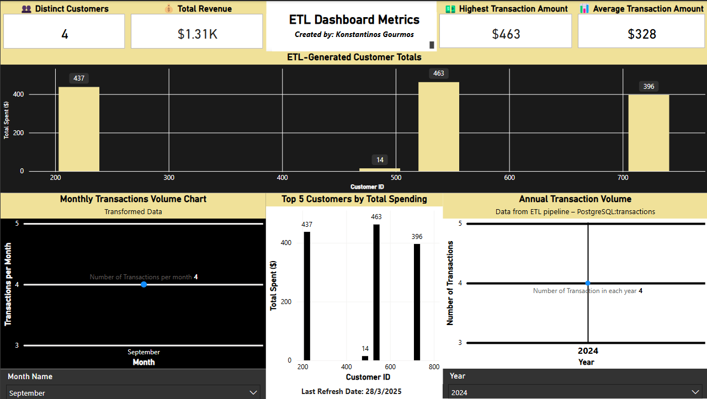

# ETL Dashboard Metrics

This project demonstrates a complete data pipeline from data ingestion to transformation, loading into databases, and visualizing insights using Power BI.

## Project Structure

- `data-generator/` - Python script that simulates transactions and sends them via API
- `ingestion-api/` - Node.js API to receive and insert data into PostgreSQL & MongoDB
- `etl/` - Python ETL job for transforming and loading customer transaction totals
- `PowerBI Dashboard` - Interactive visualization displaying KPIs and insights

## Technologies Used

- Python (ETL & Generator)
- Node.js (API)
- PostgreSQL & MongoDB (Databases)
- Power BI (Dashboard)
- Docker Compose (For containerization)

---

## Running Locally (Without Docker)

### 1. Install Prerequisites

- Python 3.10+
- Node.js 14+
- PostgreSQL
- MongoDB
- Power BI Desktop

### 2. Set up PostgreSQL

Create a PostgreSQL database called `datapipeline`, user `myuser` and password `mypassword`. You can use the following SQL:

```
CREATE DATABASE datapipeline;
CREATE USER myuser WITH PASSWORD 'mypassword';
GRANT ALL PRIVILEGES ON DATABASE datapipeline TO myuser;
```

Ensure PostgreSQL is listening on `localhost:5432`.

### 3. Set up MongoDB

Install MongoDB and ensure it runs on the default port `27017`.

### 4. Run the Ingestion API

```
cd ingestion-api
npm install
node app.js
```

### 5. Run the Data Generator

In another terminal:

```
cd data-generator
python generator.py
```

### 6. Run the ETL Job

Once some data is ingested:

```
cd etl
python etl_job.py
```

### 7. Open Power BI

Open the provided `.pbix` file and refresh the visuals. You can connect directly to the `datapipeline` PostgreSQL database.

---

## Power BI Dashboard Overview

### KPIs Displayed

- Total Revenue
- Highest Transaction Amount
- Average Transaction Amount
- Distinct Customers

### Visuals

- Monthly & Annual Transaction Volume
- Top 5 Customers by Spending
- Total Spend per Customer
- Slicers for Year and Month

### Dashboard Screenshot



---

## Files Provided

- `ETL_Dashboard.pbix` - Power BI dashboard file
- `README.txt / README.md` - Setup & Documentation

---

## Author

Created by **Konstantinos Gourmos**